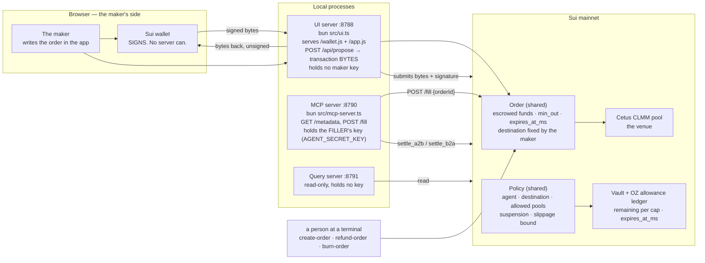
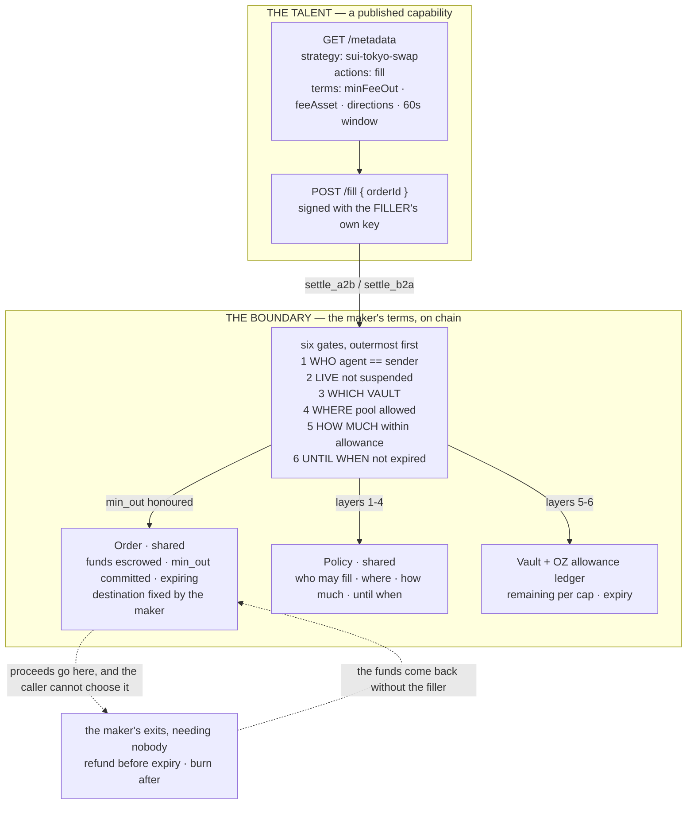
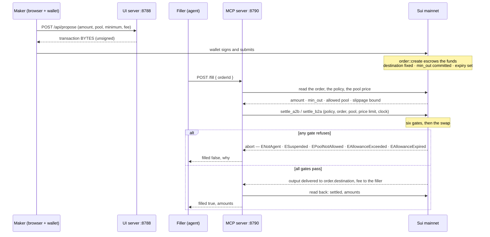

# The talent and the boundary

Two patterns carry the swap, and they meet at exactly one transaction.

- **The talent** is how a *capability* is published: a server, a manifest, one HTTP route, and a key
  behind it. It is what an agent can call.
- **The boundary** is how a capability is *limited*: Move modules and an OpenZeppelin allowance ledger
  on chain that refuse anything outside the maker's terms. It is what an agent cannot exceed.

The claim this diagram is here to make true, from the [README](../README.md):

> **The agent cannot exceed its grant, and that holds even if every server in the path is compromised.**

Wider map: [`ARCHITECTURE.md`](./ARCHITECTURE.md) for the gate stack, the swap route and the controls;
[`DECISIONS.md`](./DECISIONS.md) for why the limits are on chain at all.

---

## 1. Architecture — who runs what, and who holds a key

**Two keys, and they are not the same key.** The UI server holds no maker key at all: it builds
transaction *bytes*, keeps them, and submits bytes plus a signature it was handed — the signature is
produced by the maker's wallet in the browser. The MCP server holds the *filler's* key — the agent's
own — which can only trigger a settlement the policy permits. Neither server can move the maker's
funds anywhere the maker did not name.

---

## 2. Design — the talent and the boundary

The diagram to explain. On the left, what an agent can *call*. On the right, what it cannot *exceed*.

**Read it as a sentence:** the talent publishes one action; that action settles an order the maker
created, through six gates the maker set, and the proceeds go to an address the maker fixed.

**The caller may choose the pool, the direction, the amount and the price limit. It may never choose
where the value goes.** That single omission is why a compromised filler cannot redirect funds — and
it is the difference between a limit that is enforced and a limit that is merely intended. The six
gates are described in full in [`ARCHITECTURE.md`](./ARCHITECTURE.md#the-gate-stack).

**The maker's exits do not need the agent at all.** `refund` before expiry and `burn` after are the
maker's own paths: no agent cooperation, no agent key, no agent alive. So an agent that never fills —
or that goes dark mid-order — costs the maker time, not money.

---

## 3. One swap, end to end

Three details worth pointing at while presenting:

- **The maker's minimum is the protection, not the price limit.** The order commits `min_out`; the
  settlement asserts the actual output against it. The price limit is a second, softer bound.
- **The allowance is the ceiling on damage, and it lives in OpenZeppelin's ledger, not in our code.**
  Layers 5 and 6 are the part that makes the interval strategy possible at all — see
  [`DECISIONS.md`](./DECISIONS.md).
- **A refused gate is a feature.** Every abort code above is a sentence the maker wrote in advance,
  read back by the chain at the moment someone tried to breach it.

---

## 4. The three sentences to say out loud

1. **A talent is what an agent can call.** A server, a manifest, one route, and a key behind it — here,
   `mcp-server` on :8790 publishing `fill`, with the terms a maker is agreeing to.
2. **A boundary is what an agent cannot exceed.** An escrowed order, a policy naming the agent, the
   venue and the destination, and an allowance ledger that runs out.
3. **They meet at one transaction**: the fill. The chain checks the six gates, the output must clear
   the maker's committed minimum, and the proceeds land at an address the caller never chose.
