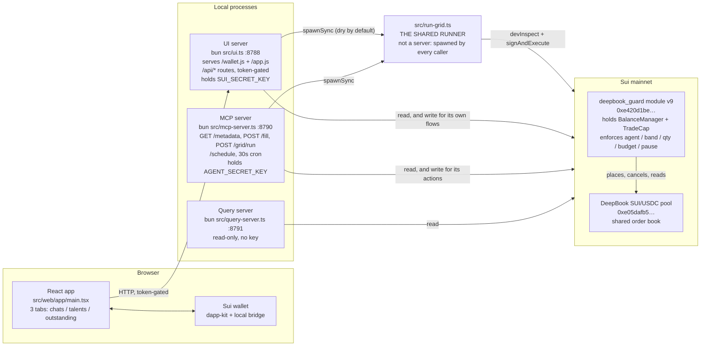
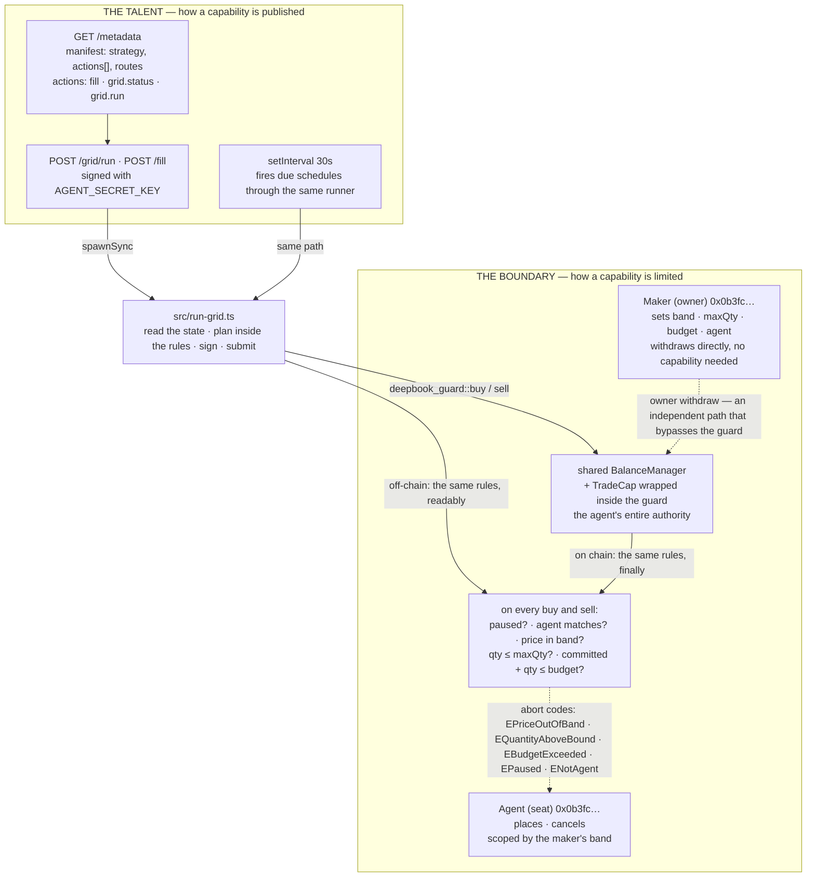
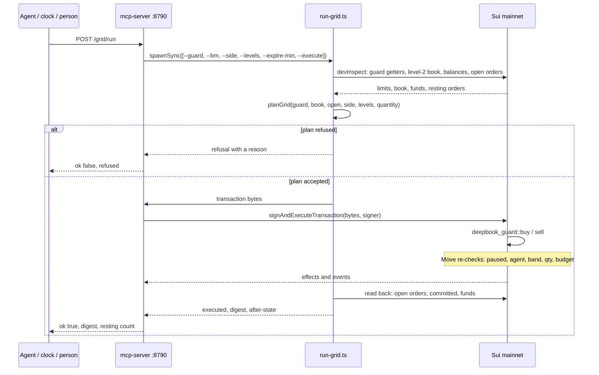

# The talent and the boundary

Two patterns carry this system, and they meet at exactly one line of code. This file is the picture of
that meeting; [`ARCHITECTURE.md`](./ARCHITECTURE.md) has the wider map — objects, the gate stack, the
object gate, what is proven.

- **The talent** is how a *capability* is published: a server, a manifest, one HTTP route per action,
  and a signing key behind it. It is what an agent can call.
- **The boundary** is how a *capability is limited*: a Move module on chain that holds the authority
  and the maker's rules, and refuses anything outside them. It is what an agent cannot exceed.

The line that joins them: **a talent's action shells out to the same runner a person runs by hand.**

---

## 1. Architecture — what runs, where, who calls whom

**The runner is deliberately not a service.** The UI, the MCP server, the cron and a person at a
terminal all execute the same file. One implementation, four entry points, and no way for them to drift
apart — which is also why the plan to "extract the runner into a shared module" was unnecessary and was
never done.

---

## 2. Design — the talent and the boundary

This is the diagram to explain. Two patterns on the left and right, and the runner in the middle.

**Read it as a sentence:** a talent action spawns the runner; the runner reads the boundary's state,
plans inside its rules, and submits a transaction the boundary enforces again on chain.

**The rules are enforced twice, and both times matter.** Off-chain, so a sloppy pass is refused with a
reason a person can read. On-chain, so a *malicious* pass is refused with an abort — the agent cannot
spend what the maker did not set, no matter what the runner is told to do or who is holding the agent
key. The second enforcement is the one that matters; the first is the one that is pleasant.

**The maker's exit does not go through the guard at all.** As the account's owner, the maker withdraws
through DeepBook's own owner path, which needs no capability. So a bug in the guard cannot trap
capital, and the guard being paused cannot lock funds in — the same property
[`ARCHITECTURE.md`](./ARCHITECTURE.md) calls the boundary that does not depend on the code.

---

## 3. One pass, end to end

The flow crosses into the boundary twice, in the same direction: once off-chain for sanity, once
on-chain for sovereignty.

Three details worth pointing at while presenting:

- **The refusal is a feature.** A pass that would breach the band or the budget is refused *before*
  signing, with the reason a maker understands. The chain would refuse it too, with an abort code.
- **The read-back is not a formality.** "Submitted" and "on the book" are different claims, and the
  runner reads the second one — which is why a pass reports `resting: 1` rather than a digest and a
  hope. It is also how a gap was found rather than hidden: an order left the book with no proceeds
  arriving anywhere these reads can see, and DeepBook's *owed* balance has no public accessor. That is
  **unresolved**, about 1.16 USDC, and this doc says so instead of dressing it as a fill.
- **`committed` is monotone.** The budget counts what the agent has ever asked for and never refunds,
  including on a cancel. That is deliberate — a budget that refilled itself would bound nothing.

---

## 4. The three sentences to say out loud

1. **A talent is what an agent can call.** A server, a manifest, one route per action, and a key behind
   it — in this repo, `mcp-server` on :8790, declaring `fill`, `grid.status` and `grid.run`.
2. **A boundary is what an agent cannot exceed.** A Move module holding the account and the trading
   capability, with the maker's band, per-order size and budget enforced on every order.
3. **The runner is where they meet** — spawned by the talent, reading the boundary, planning inside it,
   and submitting something the boundary checks again. One file, four callers, and the agent bounded by
   the maker's numbers rather than by anyone's good behaviour.
